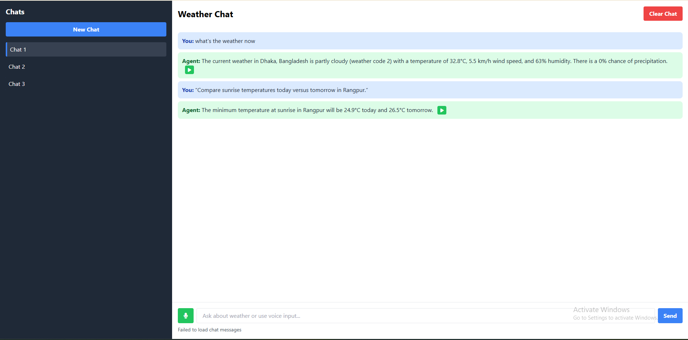

# 🌦️ AI-Powered Weather Agent

A sophisticated AI-powered weather assistant that answers complex weather queries using natural language processing and real-time weather data from the **Open-Meteo API**. This project combines a Flask backend with a simple HTML/CSS/JavaScript frontend to provide an interactive weather query interface.



## ✨ Features

- 🌐 **Natural Language Understanding**: Ask weather-related questions in plain English (e.g., "What's the weather in New York tomorrow?").
- 🌍 **Multi-location Support**: Retrieve weather updates for any city worldwide.
- ⏳ **Time-aware Queries**: Supports queries for today, tomorrow, specific dates, or relative times (e.g., "next week").
- 📊 **Comprehensive Weather Data**: Provides details on temperature, precipitation, wind speed, humidity, cloud cover, and more.
- 📍 **Smart Location Detection**: Automatically detects the user's location if not specified (requires geolocation permission).
- 🕰️ **Historical Weather**: Access historical weather data for past dates.
- 🔮 **Forecast Capability**: Get weather predictions for up to 7 days in the future.
- 🛡️ **Error Handling**: Gracefully handles invalid inputs, API failures, and ambiguous queries.
- 🎙️ **Voice Input/Output**: Use voice commands to ask weather questions and hear responses through text-to-speech (requires browser support for Web Speech API).
- 🗣️ **Chat Context Awareness**: Leverages a vector database (Pinecone) to store and retrieve chat history, enabling context-aware responses by sorting sessions for the most relevant context.
- 😊 **Sentiment Analysis**: Analyzes the sentiment of user queries to adjust the tone of responses, ensuring a more personalized and empathetic interaction.

## 🛠️ Technologies Used

- **Backend**: Python, Flask, Open-Meteo API, Grok AI (via GROQ_API_KEY), Pinecone (for vector storage and chat context), NLTK or TextBlob (for sentiment analysis)
- **Frontend**: HTML, CSS, JavaScript, Web Speech API (for voice input/output)
- **APIs and Services**:
  - Open-Meteo API for weather data
  - Grok AI for natural language processing
  - Pinecone for vector-based query storage, retrieval, and chat context management
- **Environment**: Python 3.8+

## 📋 Prerequisites

- Python 3.8 or higher
- pip (Python package manager)
- A valid **GROQ_API_KEY** for Grok AI
- A valid **PINECONE_API_KEY** for Pinecone vector storage
- Internet connection for API access
- A modern browser with Web Speech API support (e.g., Chrome, Edge) for voice features

## 🚀 Installation

1. **Clone the Repository**:
   ```bash
   git clone https://github.com/Roll-no-57/Weather-Agent.git
   ```

2. **Set Up Environment Variables**:
   Create a `.env` file in the root directory and add the following:
   ```plaintext
   GROQ_API_KEY=your-grok-api-key
   PINECONE_API_KEY=your-pinecone-api-key
   PINECONE_ENVIRONMENT=us-east-1
   ```

3. **Install Dependencies**:
   Navigate to the backend directory and install the required Python packages:
   ```bash
   pip install -r requirements.txt
   ```
   Note: Ensure `requirements.txt` includes packages like `pinecone-client` for vector storage and `textblob` or `nltk` for sentiment analysis.

4. **Start the Backend Server**:
   Run the Flask server to handle API requests:
   ```bash
   python app.py
   ```
   The server will start at `http://192.168.68.107:5000`.

5. **Start the Frontend Server**:
   Navigate to the frontend directory and start a local HTTP server:
   ```bash
   cd frontend
   python -m http.server 8000
   ```
   Access the frontend at `http://localhost:8000/chat_app.html`.

## 📂 Project Structure

```plaintext
ai-weather-agent/
├── __pycache__/
├── frontend/
│   ├── chat_app.html       # Main frontend HTML file with voice input/output
│   ├── css/                # CSS styles
│   ├── js/                 # JavaScript for frontend logic and voice features
│   └── ...                 # Other frontend assets
├── utils/
│   ├── __init__.py         # Utility module initialization
│   └── ...                 # Other utility scripts
├── .env                    # Environment variables
├── .gitignore              # Git ignore file
├── app.py                  # Flask backend server
├── database.py             # Database handling (if applicable)
├── planning_agent.py       # Planning agent logic
├── README.md               # Project documentation
├── requirements.txt        # Python dependencies
├── response.txt            # Response logging (if applicable)
├── tool.py                 # Tooling utilities
├── we_main.py              # Main weather logic
├── weather_main.py         # Weather processing logic
└── weather_tools.py        # Weather-related tools
```

## 🖥️ Usage

1. **Access the Application**:
   - Open your browser and navigate to `http://localhost:8000/chat_app.html`.
   - The interface allows you to type or speak weather-related questions.

2. **Using Voice Features**:
   - Click the microphone button on the interface to activate voice input.
   - Speak your query clearly (e.g., "What's the weather in London today?").
   - The response will be displayed on the screen and read aloud using text-to-speech.
   - Ensure your browser supports the Web Speech API and that microphone permissions are granted.

3. **Context-Aware Conversations**:
   - The app remembers previous interactions within a session using Pinecone's vector database.
   - For example, if you ask, "What's the weather in London today?" and follow up with, "What about tomorrow?", the app understands the context and responds accordingly.

4. **Sentiment-Aware Responses**:
   - The app adjusts its tone based on the sentiment of your query.
   - For example, if you ask, "Ugh, I hate this rainy weather in Seattle, what's it like tomorrow?", the app might respond in a more empathetic tone: "I’m sorry to hear that! Let’s check tomorrow’s weather in Seattle for you—it looks like it might clear up!"

5. **Example Queries**:
   - "What's the weather in London today?"
   - Follow-up: "What about tomorrow?" (context-aware)
   - "I’m so annoyed about this cold weather in Chicago, will it get better soon?" (sentiment-aware)
   - "What was the temperature in Paris on January 1, 2025?"
   - "How windy will it be in New York this weekend?"

6. **Features in Action**:
   - The backend processes your query using Grok AI to understand intent and extract location/time.
   - It fetches real-time or historical data from the Open-Meteo API.
   - Pinecone stores query vectors for efficient retrieval of similar past queries and maintains chat context by sorting sessions for relevance.
   - Sentiment analysis adjusts the tone of responses to match the user's mood.
   - The frontend displays the response in a user-friendly format and supports voice interaction.

## 🌐 API Endpoints

This section outlines the available API endpoints for interacting with the AI-Powered Weather Agent.

- **POST `/weather`**
  - **Description**: Process a weather query with natural language understanding, incorporating chat context and sentiment analysis.
  - **Request Body**: JSON object with the following fields:
    - `query` (string, required): The weather-related question (e.g., "What's the weather in London today?").
    - `user_id` (string, optional): The unique identifier for the user (defaults to "default_user").
  - **Response**:
    - Success (200): JSON object with:
      - `response` (string): The weather information or response from the agent.
      - `session_id` (string or null): The ID of the stored session, if successfully saved.
    - Error (400): JSON object with:
      - `error` (string): "No query provided".
    - Error (500): JSON object with:
      - `error` (string): Description of the error encountered during processing.
  - **Behavior**: Retrieves similar recent sessions for context, analyzes sentiment, and adjusts the tone of the response accordingly. Stores the session if the response is valid.

- **GET `/sessions/<user_id>`**
  - **Description**: Retrieve all stored sessions for a specific user.
  - **Parameters**:
    - `user_id` (string, path parameter): The unique identifier of the user.
  - **Response**:
    - Success (200): JSON object with:
      - `sessions` (array): List of session objects containing `query`, `response`, `timestamp`, etc.
    - Error (500): JSON object with:
      - `error` (string): Description of the error encountered during session retrieval.
  - **Behavior**: Fetches and returns all sessions associated with the provided `user_id` from the database.
  
## 🛠️ Development

- **Backend Development**:
  - Modify `app.py` to add new endpoints or enhance query processing.
  - Ensure the Open-Meteo API is correctly integrated for weather data.
  - Update `planning_agent.py` or `weather_main.py` for improved context handling using Pinecone.
  - Implement sentiment analysis in `weather_tools.py` or a similar module using TextBlob or NLTK.
  - Update `requirements.txt` if new Python packages are added.

- **Frontend Development**:
  - Edit `chat_app.html` and associated CSS/JS files to improve the UI/UX, including voice feature enhancements.
  - Use the Web Speech API (`SpeechRecognition` for input and `SpeechSynthesis` for output) in JavaScript for voice functionality.
  - Use AJAX or Fetch API to communicate with the Flask backend.

- **Testing**:
  - Test the application with various queries (both typed and spoken) to ensure robust natural language understanding.
  - Validate API responses for accuracy and error handling.
  - Test voice features in supported browsers to ensure compatibility.
  - Test context awareness by asking follow-up questions in a session.
  - Test sentiment analysis by using queries with different emotional tones (e.g., positive, negative, neutral).

## ⚠️ Troubleshooting

- **Server Not Starting**:
  - Ensure the `.env` file contains valid API keys.
  - Verify that port `5000` (backend) and `8000` (frontend) are not in use.
  - Check that all dependencies are installed (`pip install -r requirements.txt`).

- **API Errors**:
  - Confirm that the Open-Meteo API is accessible and not rate-limited.
  - Validate GROQ_API_KEY and PINECONE_API_KEY in the `.env` file.

- **Frontend Issues**:
  - Ensure the browser has access to `http://192.168.68.107:5000` for backend API calls.
  - Check browser console for JavaScript errors.
  - For voice features, ensure the browser supports the Web Speech API and that microphone permissions are granted.

- **Voice Feature Issues**:
  - If voice input fails, check microphone access and browser compatibility (Chrome and Edge are recommended).
  - If text-to-speech fails, ensure the browser supports `SpeechSynthesis` and that the system audio is not muted.

- **Context or Sentiment Issues**:
  - If context is not maintained, verify Pinecone integration and check for errors in vector storage/retrieval.
  - If sentiment analysis seems off, ensure the sentiment library (e.g., TextBlob) is properly installed and configured.

## 📝 Notes

- The Open-Meteo API is free but may have rate limits. Monitor usage for high-traffic applications.
- Ensure secure storage of API keys (do not commit `.env` to version control).
- For production, consider deploying the backend on a cloud service (e.g., Heroku, AWS) and using a proper web server (e.g., Gunicorn).
- Voice features depend on browser support for the Web Speech API, which may not be available in all browsers (e.g., Firefox has limited support).
- Sentiment analysis accuracy depends on the library used (e.g., TextBlob, NLTK) and may require fine-tuning for specific use cases.

## 🤝 Contributing

Contributions are welcome! Please follow these steps:
1. Fork the repository.
2. Create a new branch (`git checkout -b feature/your-feature`).
3. Commit your changes (`git commit -m "Add your feature"`).
4. Push to the branch (`git push origin feature/your-feature`).
5. Open a pull request.

## 📜 License

This project is licensed under the MIT License. See the `LICENSE` file for details.

## 📬 Contact

For questions or feedback, please open an issue on the GitHub repository or contact the maintainer at [aoarish397@example.com].
